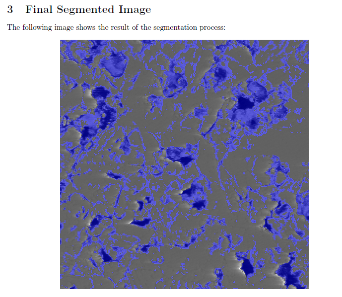

# 2D DWT Edge Detection

This Python script performs edge detection on images using the 2D Discrete Wavelet Transform (DWT). It processes an image to produce several outputs, including transformed coefficients and composite images. The script takes an input image, applies a 2D DWT, and generates visual results for analysis.

### Dependencies:

* OpenCV
* NumPy
* PyWavelets
* Matplotlib
* Tkinter (for file dialogs)

For each image, the script performs the following:

* Loads and normalizes the image.
* Applies the 2D Discrete Wavelet Transform (DWT) to obtain:
  * Approximation coefficients (\(cA\))
  * Horizontal detail coefficients (\(cH\))
  * Vertical detail coefficients (\(cV\))
  * Diagonal detail coefficients (\(cD\))
* Creates composite images by overlaying these coefficients on the original image.

To run the script, ensure you have these libraries installed and provide an appropriate input image file. The script will generate and save images for each coefficient and the final composite output.

