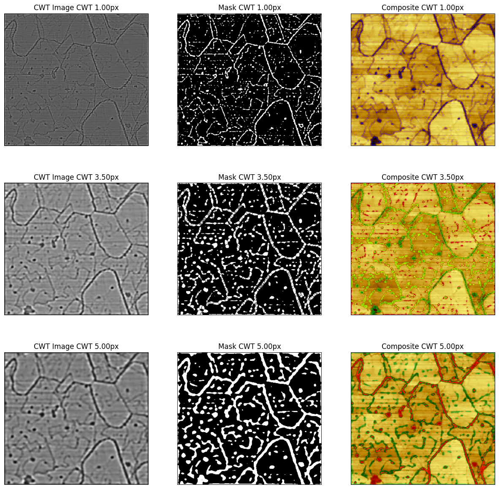

# 2D CWT Edge Detection

This Python script generates composite images by overlaying grain boundary masks on top of an original image. It takes three datasets, each containing a Continuous Wavelet Transform (CWT) image, a mask derived from that CWT, and the original image. For each dataset, the script displays:

* The CWT image (converted to gray scale).
* The mask image.
* The composite image, which is the mask blended with the original image using a colored overlay.

