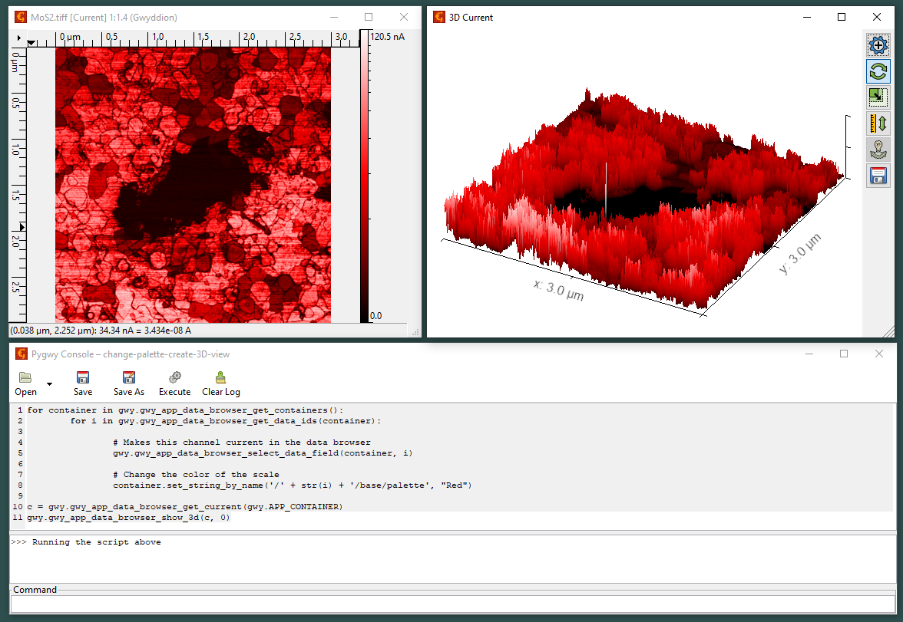

# Change Color Palette and Generate a 3D View

This Python script automates the process of iterating through data fields in all open containers within the Gwyddion data analysis software. The script modifies the color palette of each data field to "Red" and then displays a 3D view of the current container.

### Summary
1. **Iterate Through All Open Containers**

'''python
Copy code
for container in gwy.gwy_app_data_browser_get_containers():
    for i in gwy.gwy_app_data_browser_get_data_ids(container):
gwy.gwy_app_data_browser_get_containers(): Retrieves all currently open containers in the Gwyddion data browser.
gwy.gwy_app_data_browser_get_data_ids(container): Retrieves the data field IDs for each container.
'''

'''python
Copy code
# Makes this channel current in the data browser
gwy.gwy_app_data_browser_select_data_field(container, i)
gwy.gwy_app_data_browser_select_data_field(container, i): Selects the data field identified by i within the container, making it the active field in the data browser.
'''

Change the Color Palette of the Scale

'''python
Copy code
# Change the color of the scale 
container.set_string_by_name('/' + str(i) + '/base/palette', "Red")
container.set_string_by_name('/' + str(i) + '/base/palette', "Red"): Changes the color palette of the selected data field to "Red".

'''
Display the 3D View of the Current Container

'''python
c = gwy.gwy_app_data_browser_get_current(gwy.APP_CONTAINER)
gwy.gwy_app_data_browser_show_3d(c, 0)
gwy.gwy_app_data_browser_get_current(gwy.APP_CONTAINER): Retrieves the currently active container in the Gwyddion data browser.
gwy.gwy_app_data_browser_show_3d(c, 0): Displays a 3D view of the first data field in the currently active container.
'''
