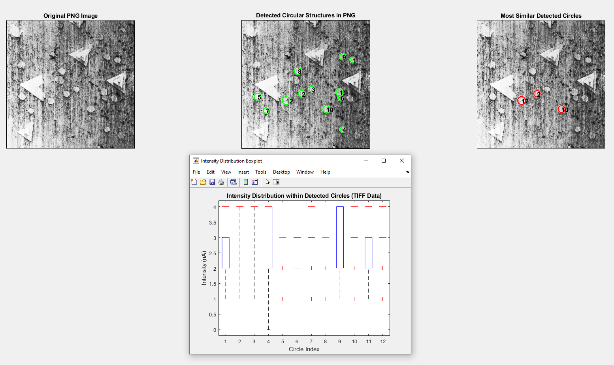
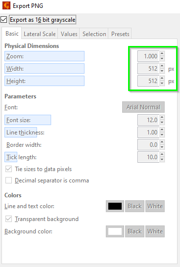

# Circular Structures Analysis

This MATLAB script performs a series of steps to analyze circular structures in an image. It utilizes both TIFF and PNG formats, with intensity calculations based on the TIFF image and circle detection via the PNG image



### Summary

1. **Load the TIFF image for intensity calculation**

    ```matlab
    % Load the TIFF image
    I_tiff = imread('tri_circ.tiff');
    ```

    - `imread('tri_circ.tiff')`: Reads the TIFF image for intensity calculations.

2. **Load the PNG image for representation**

    ```matlab
    % Load the PNG image
    I_png = imread('tri.png');
    ```

    - `imread('tri.png')`: Reads the PNG image for visual representation.

3. **Convert both images to grayscale if necessary**

    ```matlab
    % Convert TIFF and PNG images to grayscale
    if ndims(I_tiff) == 3
        I_tiff = rgb2gray(I_tiff);
    end
    if ndims(I_png) == 3
        I_png = rgb2gray(I_png);
    end
    ```

    - `rgb2gray(I_tiff)`: Converts the TIFF image to grayscale if it is a color image.
    - `rgb2gray(I_png)`: Converts the PNG image to grayscale if it is a color image.

4. **Calculate the calibration factors for the X and Y axes**

    ```matlab
    % Calculate calibration factors
    um_per_pixel = 3.00 / 512;  % 3.00 µm / 512 pixels
    fprintf('Calibration: %.5f µm/pixel\n', um_per_pixel);
    ```

    - The physical size of the image is 3.00 µm x 3.00 µm, and the resolution is 512px x 512px.
       - Calibration factor:
    
    ```math
    \text{um\_per\_pixel} = \frac{3.00 \, \mu m}{512 \, \text{pixels}} = 0.00586 \, \mu m/\text{pixel}
    ```
  
    I verified the size of my TIFF using the "Save As" function in Gwyddion.

5. **Perform Hough Transform for circle detection in the PNG image**

    ```matlab
    % Perform Hough Transform
    [centers, radii] = imfindcircles(I_png, [8 50], 'Sensitivity', 0.9);
    ```

    - `imfindcircles(I_png, [8 50], 'Sensitivity', 0.9)`: Detects circles in the PNG image with radii in the range of 8 to 50 pixels.

6. **Create a figure layout for displaying images**

    ```matlab
    % Create figure layout
    figure('Name', 'Circular Structures Analysis', 'NumberTitle', 'off', 'WindowState', 'maximized');
    t = tiledlayout(2, 3, 'Padding', 'loose', 'TileSpacing', 'loose');
    ```

    - `tiledlayout(2, 3)`: Creates a 2x3 grid for displaying images.

7. **Display the original PNG image**

    ```matlab
    % Display the original PNG image
    nexttile;
    imshow(I_png, []);
    title('Original PNG Image');
    ```

8. **Display the detected circles in the PNG image**

    ```matlab
    % Display detected circles
    nexttile;
    imshow(I_png, []);
    title('Detected Circular Structures in PNG');
    hold on;
    viscircles(centers, radii, 'EdgeColor', 'g');  % Green circles
    for i = 1:length(radii)
        text(centers(i,1), centers(i,2), num2str(i), 'Color', 'black', ...
            'FontSize', 12, 'FontWeight', 'bold');
    end
    hold off;
    ```

    - `viscircles(centers, radii, 'EdgeColor', 'g')`: Displays detected circles in green.

9. **Calculate the average intensity within each detected circle in the TIFF image**

    ```matlab
    % Calculate average intensity within each detected circle
    for i = 1:numCircles
        mask = createCircularMask(size(I_tiff), centers(i,:), radii(i));
        circle_intensities = I_tiff(mask);  % Extract pixel intensities
        circle_intensities_nA = circle_intensities * nA_per_intensity;  % Convert to nA
        intensity_values(i) = mean(circle_intensities_nA);
        all_intensities = [all_intensities; circle_intensities_nA];
        group = [group; repmat(i, length(circle_intensities_nA), 1)];
    end
    ```

    - The intensity calibration factor is `nA_per_intensity = 0.0140` nA/intensity.
    
    - Intensity calibration:
    
    ```math
    \text{circle\_intensities\_nA} = \text{circle\_intensities} \times 0.0140 \, nA
    ```

10. **Normalize the intensity data**

    ```matlab
    % Normalize intensity data
    intensity_values_norm = normalize(intensity_values);
    ```

    - `normalize(intensity_values)`: Normalizes the intensity values.

    - Normalization:
    
    ```math
    \text{intensity\_values\_norm} = \frac{\text{intensity\_values} - \text{min}}{\text{max} - \text{min}}
    ```

11. **Calculate pairwise Euclidean distances and find the most similar circles**

    ```matlab
    % Calculate Euclidean distances
    distances = pdist(intensity_values_norm);
    dist_matrix = squareform(distances);
    [~, most_similar_idx] = mink(sum(dist_matrix), 3);
    ```

    - The most similar circles are identified based on the smallest pairwise Euclidean distances.
    
    - Euclidean distance calculation:
    
    ```math
    d(i,j) = \sqrt{(x_i - x_j)^2 + (y_i - y_j)^2}
    ```

12. **Highlight the most similar circles in red**

    ```matlab
    % Highlight the most similar circles
    nexttile;
    imshow(I_png, []);
    title('Most Similar Detected Circles');
    hold on;
    viscircles(centers(most_similar_idx, :), radii(most_similar_idx), 'EdgeColor', 'r');  % Red circles
    for i = 1:length(most_similar_idx)
        text(centers(most_similar_idx(i), 1), centers(most_similar_idx(i), 2), ...
            num2str(most_similar_idx(i)), 'Color', 'black', 'FontSize', 12, 'FontWeight', 'bold');
    end
    hold off;
    ```

    - The three most similar circles are highlighted in red.

13. **Plot box plots of intensity distributions**

    ```matlab
    % Plot intensity distribution box plots
    figure('Name', 'Intensity Distribution Boxplot', 'NumberTitle', 'off');
    boxplot(all_intensities, group, 'Labels', arrayfun(@num2str, 1:numCircles, 'UniformOutput', false));
    title('Intensity Distribution within Detected Circles (TIFF Data)');
    xlabel('Circle Index');
    ylabel('Intensity (nA)');
    ```

14. **Display the circle data in a table**

    ```matlab
    % Display circle data in a table
    circle_table = cell2table(circle_data, 'VariableNames', {'Circle Index', 'X Coordinate', 'Y Coordinate', 'Mean Intensity (nA)'});
    disp(circle_table);
    ```

    - The circle data, including circle index, coordinates, and mean intensity, is displayed in a table format.

### Additional Function

```matlab
% Function to create a circular mask
function mask = createCircularMask(imageSize, center, radius)
    [X, Y] = meshgrid(1:imageSize(2), 1:imageSize(1));
    mask = (X - center(1)).^2 + (Y - center(2)).^2 <= radius^2;
end
