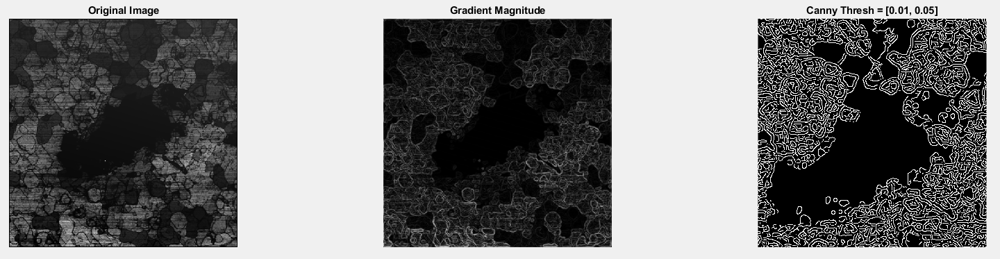

## Gradient Magnitude Canny Edge Detection Using MATLAB

The following MATLAB script reads an image, converts it to grayscale, computes the gradient magnitudes using Gaussian x & y derivatives, and applies Canny edge detection with different threshold levels.



### Summary

1. **Read an image and convert to grayscale and double precision**

```matlab
% Read an image
I = imread('Current_Backward_sample_2_leveled.png');
I = rgb2gray(I); % Convert to grayscale if it's a color image
I = double(I); % Convert to double precision
```

- `imread('Current_Backward_sample_2_leveled.png')`: Reads the image file.
- `rgb2gray(I)`: Converts the image to grayscale if it is a color image.
- `double(I)`: Converts the image to double precision for further processing.

2. **Define the standard deviation for Gaussian kernel**

```matlab
% Define the standard deviation for Gaussian kernel
sigma = 1;
```

`sigma = 1`: Sets the standard deviation for the Gaussian kernel.

3. **Create Gaussian derivative filters**

```matlab
% Create Gaussian derivative filters
G = fspecial('gaussian', [6*sigma, 6*sigma], sigma);
[Gx, Gy] = gradient(G);
```

- `fspecial('gaussian', [6*sigma, 6*sigma], sigma)`: Creates a Gaussian filter.
- `[Gx, Gy] = gradient(G)`: Computes the gradient of the Gaussian filter in the x and y directions.

### Gradient of the Gaussian Filter

The gradient of the Gaussian filter in the \( x \) and \( y \) directions can be computed using the partial derivatives of the Gaussian function.

4. **Apply the filters to the image and compute the gradient magnitude**

```matlab
% Apply the filters to the image
Ix = imfilter(I, Gx, 'conv', 'replicate');
Iy = imfilter(I, Gy, 'conv', 'replicate');

% Compute the gradient magnitude
Gmag = sqrt(Ix.^2 + Iy.^2);
```

- `imfilter(I, Gx, 'conv', 'replicate')`: Applies the Gaussian derivative filter in the x direction to the image.
- `imfilter(I, Gy, 'conv', 'replicate')`: Applies the Gaussian derivative filter in the y direction to the image.
- `sqrt(Ix.^2 + Iy.^2)`: Computes the gradient magnitude by combining the gradients in the x and y directions.

### Gradient Magnitude Calculation

The gradient magnitude is calculated using the following equation:

$$
G_{mag} = \sqrt{I_x^2 + I_y^2}
$$

where \( I_x \) and \( I_y \) are the gradients in the x and y directions, respectively.

5. **Define different threshold pairs for Canny edge detection**

```matlab
% Define different threshold pairs for Canny edge detection
thresholds = [0.01, 0.05; 0.02, 0.08; 0.04, 0.12; 0.06, 0.20];
```

- `thresholds = [0.01, 0.05; 0.02, 0.08; 0.04, 0.12; 0.06, 0.20]`: Defines different threshold pairs for Canny edge detection.

### Canny Edge Detection

The Canny edge detection algorithm uses two thresholds to detect strong and weak edges. The thresholds are defined as:

$$
	ext{Thresholds} = [T_{low}, T_{high}]
$$

where \( T_{low} \) and \( T_{high} \) are the lower and upper thresholds, respectively.

6. **Display the results**

```matlab
% Display the results
figure;
subplot(2, 3, 1);
imshow(I, []);
title('Original Image');

subplot(2, 3, 2);
imshow(Gmag, []);
title('Gradient Magnitude');

% Apply and display Canny edge detection with different thresholds
for i = 1:size(thresholds, 1)
    thresh = thresholds(i, :);
    BW = edge(Gmag, 'Canny', thresh);
    subplot(2, 3, i + 2);
    imshow(BW);
    title(sprintf('Canny Thresh = [%.2f, %.2f]', thresh(1), thresh(2)));
end
```
