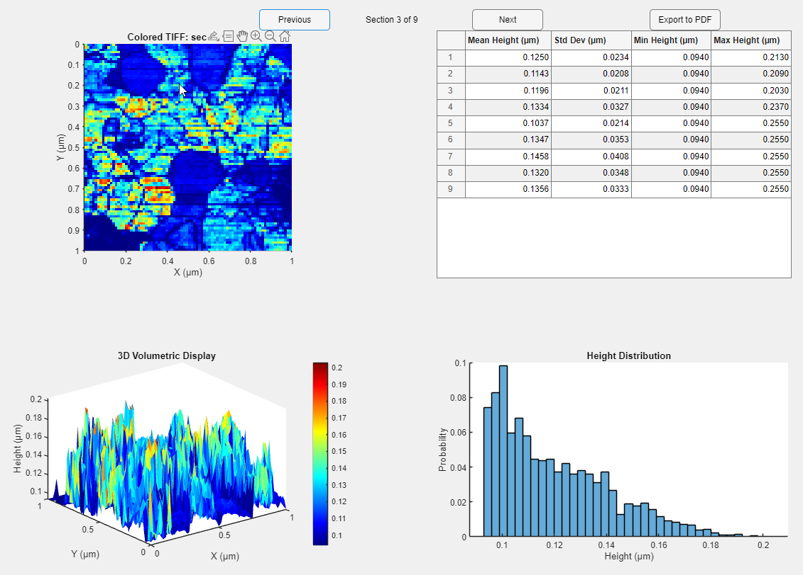

## Height Profiler MATLAB App

The following MATLAB script creates GUI display of a user defined  TIFF image with a heatmap, a 3D volumetric representation of the surface data, a histogram of height distributions, and statistical height data in a table. Users can export all the visual and statistical data of each section to a multi-page PDF file for further analysis.****

### Summary

1. Still working on the explainer doc. 
