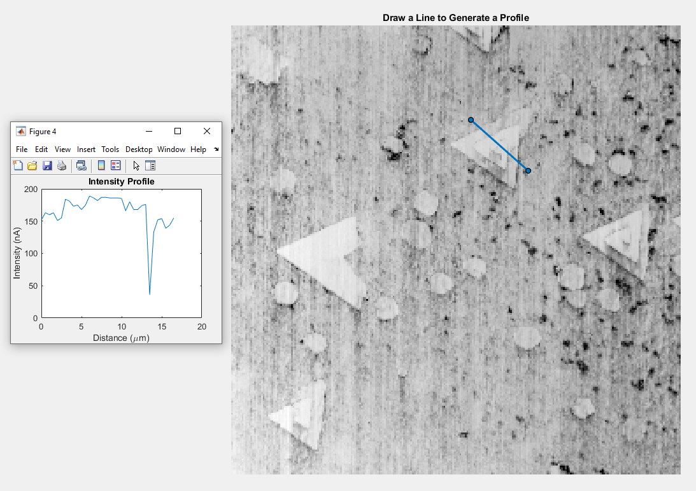

## Intesnity Generator from TIFF File Using MATLAB

The following MATLAB script allows a user to generate an intensity profile by defining a line of interest.



Parity verified in Gwydion

### Summary

1. **Input the TIFF**: The script starts by reading a TIFF image using the `imread` function.

```matlab
I = imread('Current_Backward.tiff');
```

2. **Display the Image**: The TIFF is displayed using the `imshow` function, and a title is added to prompt the user to draw a line.

```matlab
figure;
imshow(I, []);
title('Draw a Line to Generate a Profile');
```

3. **Draw Line**: The `drawline` function is used to allow the user to draw a line on the image interactively.

```matlab
h = drawline;
```

4. **Add Listener for Line Drawing**: A listener is added to detect when the line is drawn, triggering the `profileCallback` function.

```matlab
addlistener(h, 'ROIClicked', @(src, evt) profileCallback(src, I));
```

5. **Calculate Intensity Profile**: Inside the `profileCallback` function, the position of the line is determined, and the intensity profile along the line is calculated using the `improfile` function.

```matlab
pos = h.Position;
c = improfile(I, pos(:,1), pos(:,2));
```
$$
\mathbf{c} = 	ext{improfile}(I, [x_1, x_2], [y_1, y_2])
$$

6. **Define Conversion Factors**: Conversion factors for intensity (to nanoamperes, nA) and distance (to micrometers, µm) are defined.

```matlab
nA_conversion_factor = 1;  % Conversion factor to nA
um_per_pixel = 0.5;  % Conversion factor to µm, for example, 1 pixel = 0.5 µm
```

7. **Generate Distance Vector**: A distance vector for the x-axis in micrometers is generated based on the number of points in the intensity profile and the conversion factor.

```matlab
num_points = length(c);
distance_um = (0:num_points-1) * um_per_pixel;
```

8. **Plot Intensity Profile**: Finally, the intensity profile is plotted in nanoamperes against the distance in micrometers.

```matlab
figure;
plot(distance_um, c * nA_conversion_factor);
title('Intensity Profile');
xlabel('Distance (\mum)');
ylabel('Intensity (nA)');
```
